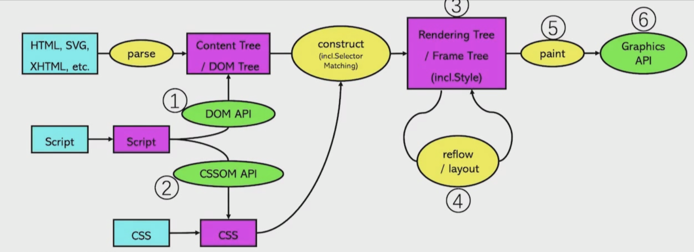

# 2.0 页面渲染架构设计&选型

## 页面渲染过程

1. 浏览器解析 HTML，生成 DOM Tree(Parse HTML)

2. 浏览器解析 CSS，生成CSSOM (CSS Object Mode el) Tree。

3. JavaScript会通过 DOM API和 CSSOM API 来操作 DOM Tree 和 CSS Rule Tree，浏览器将DOM Tree和CSSOM Tree合成渲染树(Render Tree)。

4. 布局(Layout): 根据生成的Render Tree，进行回流，以计算每个节点的几何信息(位置、大小、字体样式等等)。

5. 绘制(Painting): 根据渲染树和回流得到的几何信言息，得到每个节点的绝对像素。

6. 展示(Display): 将像素发送给图形处理器(GPU)，展示在页面上。

## 页面渲染技术架构和方案

1. 服务端渲染

- 后端同步渲染、同构直出、BigPipe

1. 客户端渲染

- JavaScript 渲染:静态化、前后端分离、单页面应用
- Web App: Angular、React、Vue等，PWA
- 原生 App:iOS、Android
- Hybrid App: PhoneGap、AppCan 等
- 跨平台开发:RN、Flutter、小程序等

## 后端同步渲染

### 同步渲染步骤(以JSP 为例)

- 步骤1:JSP Servlet 映射以.jsp 结尾的 URL，当.jsp文件请求时，servlet容器知道要调用哪个 Servlet。
- 步骤2:Servlet 容器检查Servlet是否已被编译。
- 步骤3:如果未在步骤2中进行编译，则Servlet容器会将JSP转换为Servlet代码，并进行编译。
- 步骤4:Servlet 容器将JSP请求转发到编译JSP Servlet 类。
- 步骤5:JSP Servlet类返回并发送给客户端浏览器HTML。

### 技术优点

- 快速实现业务开发并上线

### 技术不足

- 需要先实现业务逻辑和功能，再输出HTML内容给浏览器，用户需等待HTML页面完全加载之后才能看到页面内容;代码耦合严重，不太好业务逻辑和页面模板;需求变更上线周期相对较长。

### 协作方式

- 前端出静态页面，后端套页面

### 选型建议

- 如果是创业初期验证阶段，或者20个研发人员以内的项目，为了满足业务快速验证并一天内多次上线，技术选型上使用服务端同步渲染没有任何问题，一人字就是“快”。

### 协作力器

- jSmart
- Velocity.js
